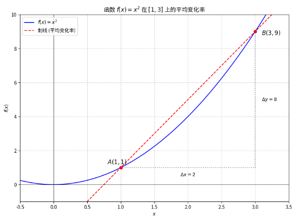
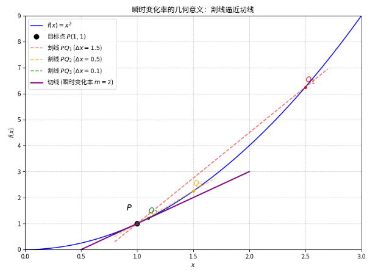

# 单变量微积分系列（一）：函数与变化率——微积分的起点

## 1. 什么是微积分？（引言与历史动机）

微积分（Calculus）是数学领域中最伟大、最实用的发明之一，它彻底改变了我们理解和描述世界的方式。从十七世纪艾萨克·牛顿（Isaac Newton）和戈特弗里德·莱布尼茨（Gottfried Leibniz）各自独立地发展出这套理论体系以来，它就成为了现代科学和工程学的基石。

### 为什么需要微积分？

微积分的诞生源于人类对**运动**和**变化**的深刻好奇。

想象一下，你正在研究一个物体从 $A$ 点运动到 $B$ 点的过程。

*   **传统数学（代数、几何）**：可以轻松计算物体在匀速运动时的**总距离**和**平均速度**。
*   **微积分**：旨在解决更复杂、更真实的问题：
    1.  **变速运动**：如何精确地描述物体在某一**瞬间**的速度？（例如：火箭点火后第 $5.001$ 秒的速度是多少？）
    2.  **不规则图形**：如何计算一个不规则曲线下的**面积**或不规则曲面围成的**体积**？（例如：计算一个变速运动的物体在一段时间内行驶的**总距离**，这相当于求速度曲线下的面积。）

微积分正是为了解决这些涉及“无限小”和“无限累加”的问题而诞生的。它主要围绕两个核心概念展开：

1.  **微分学（Differential Calculus）**：研究**瞬间变化率**，即**导数**。它帮助我们从整体的变化（平均变化率）过渡到局部的变化（瞬时变化率）。
2.  **积分学（Integral Calculus）**：研究**累积效应**，即**积分**。它帮助我们通过无限小的累加来计算总量。

连接这两大学科的桥梁，就是微积分的**基本定理**。而这一切的逻辑起点，是**极限**（Limit）。

## 2. 预备知识：函数（Function）的视角

在微积分中，我们研究的对象几乎都是**函数**。函数是描述变化关系最基本的数学工具。

> **定义回顾**：函数 $f$ 是一个规则，它将定义域（输入值 $x$ 的集合）中的每一个元素，唯一地对应到值域（输出值 $y$ 或 $f(x)$ 的集合）中的一个元素。

我们用 $y = f(x)$ 来表示，其中 $x$ 是**自变量**，代表输入或原因；$y$ 是**因变量**，代表输出或结果。

### 为什么微积分偏爱“光滑”的函数？

在微积分中，我们特别关注那些图像是**连续**且**光滑**的函数。

*   **连续性**：函数的图像没有断裂，你可以一笔画完。这意味着在 $x$ 发生微小变化时，$f(x)$ 也只会发生微小变化。
*   **光滑性**：函数的图像没有尖角或突变。这意味着在每一点上，我们都能找到一个确定的切线斜率。

微积分的工具（导数和积分）正是为处理这类“表现良好”的函数而设计的。例如，我们熟悉的二次函数 $f(x) = x^2$ 就是一个完美的例子。

## 3. 变化的量化：平均变化率（Average Rate of Change）

在日常生活中，我们最常接触的是**平均变化率**。它描述的是在一段**有限**的区间内，事物变化的快慢。

### 物理意义：平均速度

假设你从家（位置 $P_1$）出发，经过 $2$ 小时到达学校（位置 $P_2$），总共行驶了 $10$ 公里。你的**平均速度**就是 $10 \text{公里} / 2 \text{小时} = 5 \text{公里/小时}$。

在数学上，我们用 $\Delta$（Delta，表示“变化量”）符号来表示这种变化：

*   输入的变化量：$\Delta x = x_2 - x_1$
*   输出的变化量：$\Delta y = f(x_2) - f(x_1)$

> **平均变化率公式**：
>
> $$\text{平均变化率} = \frac{\text{输出变化量}}{\text{输入变化量}} = \frac{\Delta y}{\Delta x} = \frac{f(x_2) - f(x_1)}{x_2 - x_1}$$

### 几何意义：割线斜率的精确解读

平均变化率在几何上对应着函数图像上两点 $A(x_1, f(x_1))$ 和 $B(x_2, f(x_2))$ 之间连线的**斜率**，这条连线被称为**割线**（Secant Line）。

**示例：计算 $f(x) = x^2$ 在 $[1, 3]$ 上的平均变化率**

我们取 $x_1 = 1$ 和 $x_2 = 3$：
1.  **确定两点坐标**：
    *   点 $A$: $x_1 = 1$, $f(1) = 1^2 = 1$. 坐标为 $(1, 1)$。
    *   点 $B$: $x_2 = 3$, $f(3) = 3^2 = 9$. 坐标为 $(3, 9)$。
2.  **计算变化量**：
    *   $\Delta x = 3 - 1 = 2$
    *   $\Delta y = 9 - 1 = 8$
3.  **计算平均变化率**：
    *   $$\text{平均变化率} = \frac{\Delta y}{\Delta x} = \frac{8}{2} = 4$$

这个结果 $4$ 告诉我们，在 $x$ 从 $1$ 变化到 $3$ 的过程中，函数 $f(x) = x^2$ 的图像平均每向右移动 $1$ 个单位，就向上升高 $4$ 个单位。

下图清晰地展示了割线 $AB$ 的斜率如何代表这个平均变化率 $4$。注意图中用虚线构成的直角三角形，其两直角边就是 $\Delta x$ 和 $\Delta y$。

## 4. 逼近瞬间：瞬时变化率（Instantaneous Rate of Change）的诞生

平均变化率虽然易于计算和理解，但它掩盖了变化过程中的所有细节。微积分的核心挑战，正是要突破这种“平均”的限制，去捕捉**瞬间**的变化。

### 问题的核心：如何定义“瞬间”？

我们想知道函数 $f(x)$ 在**某一点** $x_1$ 上的变化率，例如 $f(x) = x^2$ 在 $x=1$ 处的精确变化率。

如果我们试图用平均变化率的公式来计算，但将 $x_2$ 设为 $x_1$，即 $\Delta x = 0$，我们就会遇到数学上的“悖论”：

$$\frac{\Delta y}{\Delta x} = \frac{f(x_1) - f(x_1)}{x_1 - x_1} = \frac{0}{0}$$

这个 $\frac{0}{0}$ 形式被称为**不定式**。它不是一个确定的数值，而是告诉我们：这个表达式的极限是存在的，但需要更巧妙的方法来计算。

### 几何直觉：从割线到切线

微积分的精妙之处在于，它将这个代数上的难题转化为了一个几何上的直观过程：

1.  **固定点 $P$**：我们固定我们想要研究的点 $P(x_1, f(x_1))$。
2.  **移动点 $Q$**：我们选择一个临近点 $Q(x_2, f(x_2))$，并计算割线 $PQ$ 的斜率。
3.  **无限逼近**：我们让点 $Q$ 沿着曲线**无限地靠近**点 $P$。

当 $Q$ 无限接近 $P$ 时，割线 $PQ$ 就会无限地接近曲线在点 $P$ 上的**切线**（Tangent Line）。

*   **割线**：穿过曲线上**两点**的直线，代表**平均变化率**。
*   **切线**：只“接触”曲线上的**一点**（在这一点附近），代表**瞬时变化率**。

**切线的斜率**，就是我们所追求的**瞬时变化率**。

下图展示了这一逼近过程。我们固定点 $P(1, 1)$，让 $Q$ 点不断靠近 $P$（即 $\Delta x$ 不断减小），割线 $PQ$ 的斜率逐渐趋近于切线的斜率 $2$。

### 引入数学工具：极限（Limit）

为了将“无限逼近”这个直观的几何概念转化为严谨的数学语言，我们必须引入微积分的基石——**极限**。

我们用 $x_2 = x_1 + \Delta x$ 来表示 $Q$ 点的横坐标。那么平均变化率的公式可以改写为：

$$\text{平均变化率} = \frac{f(x_1 + \Delta x) - f(x_1)}{\Delta x}$$

现在，我们用极限符号 $\lim$ 来描述 $\Delta x$ 无限趋近于 $0$ 的过程：

$$\text{瞬时变化率} = \lim_{\Delta x \to 0} \frac{f(x_1 + \Delta x) - f(x_1)}{\Delta x}$$

这里的 $\lim_{\Delta x \to 0}$ 读作“当 $\Delta x$ 趋近于 $0$ 时，整个表达式的极限”。它描述的是：虽然 $\Delta x$ 永远不会等于 $0$，但我们可以观察到，随着 $\Delta x$ 越来越小，这个分数所趋向的那个**唯一确定的值**。

这个极限的结果，就是函数 $f(x)$ 在点 $x_1$ 处的**导数**（Derivative），记作 $f'(x_1)$。

## 5. 总结与展望

我们已经完成了从宏观的**平均变化率**到微观的**瞬时变化率**的思维飞跃。

| 概念 | 几何意义 | 代数表达式 | 描述对象 |
| :--- | :--- | :--- | :--- |
| **平均变化率** | 割线的斜率 | $\frac{f(x_2) - f(x_1)}{x_2 - x_1}$ | 一段区间内的平均变化情况 |
| **瞬时变化率** | 切线的斜率 | $\lim_{\Delta x \to 0} \frac{f(x_1 + \Delta x) - f(x_1)}{\Delta x}$ | 某一瞬间的精确变化情况 |

我们已经找到了微积分的第一个核心概念——**导数**的定义，但它的计算完全依赖于**极限**。

在下一篇文章中，我们将放下对变化的关注，转而深入探索微积分的真正基石：**极限**。我们将学习如何用严谨的数学语言来定义“无限接近”，并掌握计算极限的基本方法，从而真正掌握微积分的入门钥匙。

**下一篇预告：** 《单变量微积分系列博客（二）：微积分的基石——极限的定义与计算》