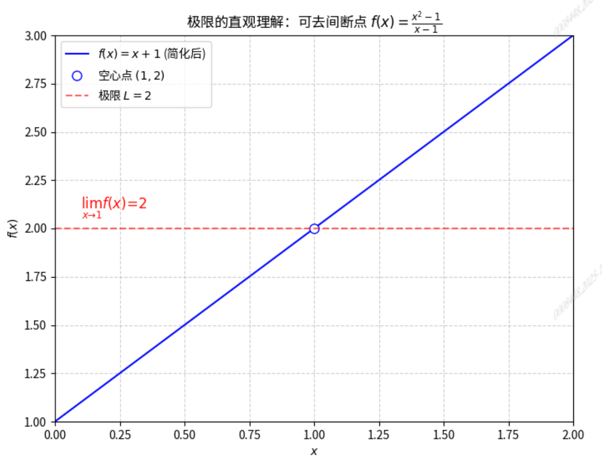
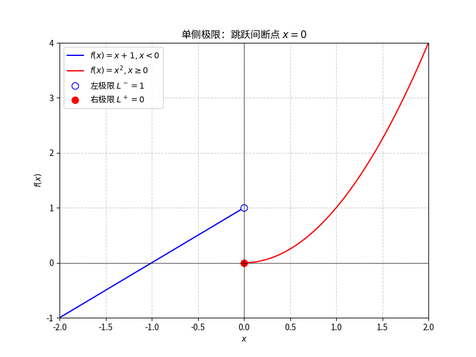
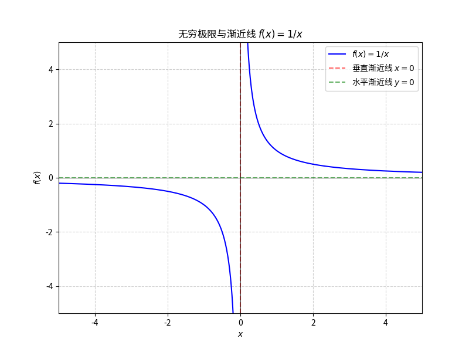

# 单变量微积分系列（二）：微积分的基石——极限的定义与计算

## 1. 极限：微积分的灵魂（引言）

在上一篇文章中，我们探讨了微积分的起源，发现要精确描述一个函数在某一**瞬间**的变化率，我们遇到了一个代数上的难题：$\frac{0}{0}$ 型不定式。我们意识到，解决这个问题的关键在于找到一种数学工具，能够严谨地描述**“无限接近”**这个概念。

这个工具，就是**极限**（Limit）。

极限是微积分的灵魂，它将传统的代数和几何从静态的、有限的世界，带入了动态的、无限的世界。没有极限，就没有微积分。

> **极限的哲学**：极限描述的是一个过程的**趋势**，是**趋近**而非**到达**。就像你永远无法真正走到墙边，但你可以无限地靠近它。

## 2. 极限的直观定义

我们首先从直观上理解极限的含义，然后学习如何用数学符号来表达它。

### 符号表示

一个函数 $f(x)$ 在 $x$ 趋近于 $a$ 时的极限，记作：

$$\lim_{x \to a} f(x) = L$$

*   **读作**：“当 $x$ 趋近于 $a$ 时，$f(x)$ 的极限是 $L$。”
*   **含义**：当 $x$ 的值无限地靠近 $a$（但 $x \neq a$）时，$f(x)$ 的值无限地靠近一个确定的数值 $L$。

### 关键点：极限与函数值无关

理解极限的关键在于：**极限 $L$ 的值与函数在 $a$ 点的实际值 $f(a)$ 是无关的。**

$f(a)$ 可能存在，可能不存在，甚至可能存在但与 $L$ 不相等。极限只关心 $x$ 在 $a$ **附近**的表现。

**示例 1：可去间断点**

考虑函数 $f(x) = \frac{x^2 - 1}{x - 1}$。

1.  **函数值 $f(1)$**：当 $x=1$ 时，分母为 $0$，分子也为 $0$，所以 $f(1)$ **没有定义**。
2.  **极限 $\lim_{x \to 1} f(x)$**：
    *   当 $x \neq 1$ 时，我们可以对函数进行化简：
        $$f(x) = \frac{(x - 1)(x + 1)}{x - 1} = x + 1$$
    *   随着 $x$ 越来越接近 $1$，虽然 $x$ 永远不会等于 $1$，但 $f(x)$ 的值会越来越接近 $1 + 1 = 2$。
    *   因此，$$\lim_{x \to 1} \frac{x^2 - 1}{x - 1} = 2$$

如下图所示，函数图像在 $x=1$ 处有一个**空心点**（可去间断点），但它的极限是存在的，为 $2$。

## 3. 单侧极限（One-Sided Limits）

在某些情况下，函数从左边趋近 $a$ 和从右边趋近 $a$ 时，其趋势可能不同。这时，我们就需要引入**单侧极限**。

### 定义

1.  **左极限**：当 $x$ 从小于 $a$ 的方向趋近 $a$ 时，$f(x)$ 的极限。
    $$\lim_{x \to a^-} f(x) = L_1$$
2.  **右极限**：当 $x$ 从大于 $a$ 的方向趋近 $a$ 时，$f(x)$ 的极限。
    $$\lim_{x \to a^+} f(x) = L_2$$

### 极限存在的充要条件

一个函数 $f(x)$ 在 $x \to a$ 时的极限 $L$ **存在**，当且仅当它的左极限和右极限都存在，并且它们相等：

$$\lim_{x \to a} f(x) = L \iff \lim_{x \to a^-} f(x) = \lim_{x \to a^+} f(x) = L$$

如果 $L_1 \neq L_2$，则我们说 $\lim_{x \to a} f(x)$ **不存在**。

**示例 2：跳跃间断点**

考虑分段函数 $f(x)$ 在 $x=0$ 处的极限：
$$f(x) = \begin{cases} x+1 & x < 0 \\ x^2 & x \ge 0 \end{cases}$$

1.  **左极限**（$x \to 0^-$，即 $x$ 从负方向趋近 $0$）：
    $$\lim_{x \to 0^-} f(x) = \lim_{x \to 0^-} (x + 1) = 0 + 1 = 1$$
2.  **右极限**（$x \to 0^+$，即 $x$ 从正方向趋近 $0$）：
    $$\lim_{x \to 0^+} f(x) = \lim_{x \to 0^+} x^2 = 0^2 = 0$$

因为左极限 $1$ 不等于右极限 $0$，所以 $\lim_{x \to 0} f(x)$ **不存在**。这在几何上表现为函数图像在 $x=0$ 处有一个**跳跃**（跳跃间断点）。

## 4. 无穷极限与渐近线

极限不仅可以描述 $x$ 趋近于一个有限值时的趋势，还可以描述 $x$ 或 $f(x)$ 趋向于**无穷大**时的趋势。

### 趋向无穷的极限（水平渐近线）

当 $x$ 无限增大（$x \to \infty$）或无限减小（$x \to -\infty$）时，如果 $f(x)$ 趋近于一个有限值 $L$，则我们说 $y=L$ 是函数的**水平渐近线**。

$$\lim_{x \to \infty} f(x) = L \quad \text{或} \quad \lim_{x \to -\infty} f(x) = L$$

### 极限为无穷（垂直渐近线）

当 $x$ 趋近于某个有限值 $a$ 时，如果 $f(x)$ 的值无限增大（$\to \infty$）或无限减小（$\to -\infty$），则我们说 $x=a$ 是函数的**垂直渐近线**。

$$\lim_{x \to a} f(x) = \infty \quad \text{或} \quad \lim_{x \to a} f(x) = -\infty$$

**示例 3：$f(x) = \frac{1}{x}$ 的渐近线**

1.  **水平渐近线**：
    $$\lim_{x \to \infty} \frac{1}{x} = 0 \quad \text{且} \quad \lim_{x \to -\infty} \frac{1}{x} = 0$$
    这意味着 $y=0$（$x$ 轴）是水平渐近线。
2.  **垂直渐近线**：
    $$\lim_{x \to 0^+} \frac{1}{x} = +\infty \quad \text{且} \quad \lim_{x \to 0^-} \frac{1}{x} = -\infty$$
    这意味着 $x=0$（$y$ 轴）是垂直渐近线。

## 5. 极限的计算方法

在实际应用中，我们很少需要使用复杂的 $\epsilon-\delta$ 定义来计算极限（这是大学数学分析的内容）。对于工程师来说，掌握以下几种计算方法至关重要：

| 方法 | 适用情况 | 示例 |
| :--- | :--- | :--- |
| **直接代入法** | 适用于函数在 $x=a$ 处**连续**的情况。 | $\lim_{x \to 2} (x^2 + 3) = 2^2 + 3 = 7$ |
| **化简法** | 适用于 $\frac{0}{0}$ 型不定式，通过**因式分解**或**有理化**消除导致分母为零的项。 | $\lim_{x \to 1} \frac{x^2 - 1}{x - 1} = \lim_{x \to 1} (x + 1) = 2$ |
| **无穷代换法** | 适用于 $x \to \pm\infty$ 的有理分式，只看分子和分母的**最高次项**。 | $\lim_{x \to \infty} \frac{3x^2 + 2x}{x^2 - 5} = \lim_{x \to \infty} \frac{3x^2}{x^2} = 3$ |
| **运算法则** | 极限的加、减、乘、除（分母极限不为零）可以分别计算。 | $\lim_{x \to a} [f(x) + g(x)] = \lim_{x \to a} f(x) + \lim_{x \to a} g(x)$ |

### 重点：化简法（解决 $\frac{0}{0}$ 不定式）

化简法是连接极限和导数的关键。正是因为我们可以通过代数化简来消除不定式，才能找到瞬时变化率的精确值。

**例题：** 计算 $\lim_{h \to 0} \frac{(2 + h)^2 - 4}{h}$

这个极限正是函数 $f(x) = x^2$ 在 $x=2$ 处的瞬时变化率（导数）的定义式。

1.  **展开分子**：
    $$(2 + h)^2 - 4 = (4 + 4h + h^2) - 4 = 4h + h^2$$
2.  **化简**：
    $$\lim_{h \to 0} \frac{4h + h^2}{h}$$
3.  **提取公因式 $h$ 并约分**（因为 $h \to 0$，所以 $h \neq 0$，可以约分）：
    $$\lim_{h \to 0} \frac{h(4 + h)}{h} = \lim_{h \to 0} (4 + h)$$
4.  **直接代入**：
    $$\lim_{h \to 0} (4 + h) = 4 + 0 = 4$$

因此，函数 $f(x) = x^2$ 在 $x=2$ 处的瞬时变化率（导数）为 $4$。

## 6. 总结与展望

极限是微积分的逻辑起点，它为我们提供了一种精确描述“无限接近”的语言。

*   **极限的定义**：描述 $x$ 趋近 $a$ 时，$f(x)$ 趋近 $L$ 的趋势。
*   **单侧极限**：用于判断极限是否存在，左右极限必须相等。
*   **无穷极限**：用于描述渐近线。
*   **计算方法**：代入、化简（因式分解/有理化）、无穷代换。

掌握了极限，我们就掌握了微积分的基石。在下一篇文章中，我们将把极限的概念应用到函数上，正式引入**连续性**和**导数的定义**，从而真正开始微分学的学习。

**下一篇预告：** 《单变量微积分系列博客（三）：连续性与导数的定义》
