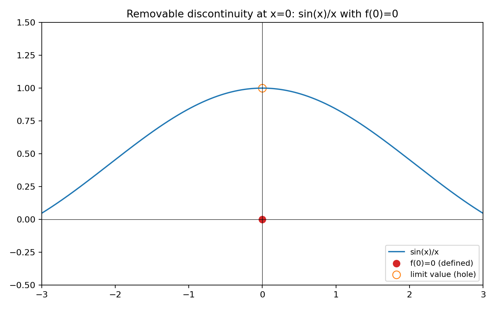
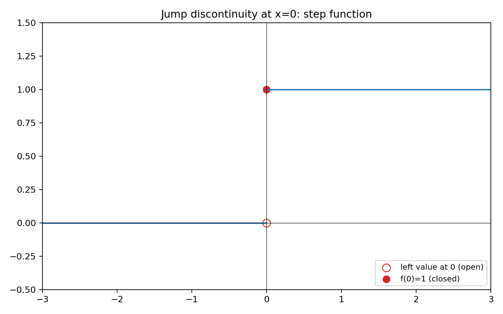
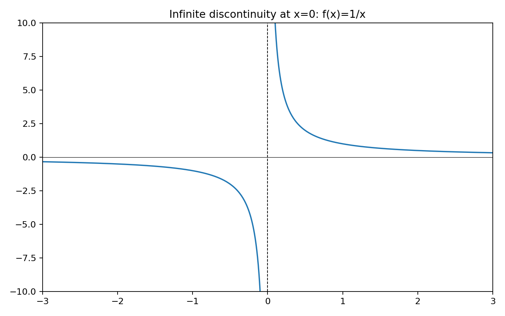
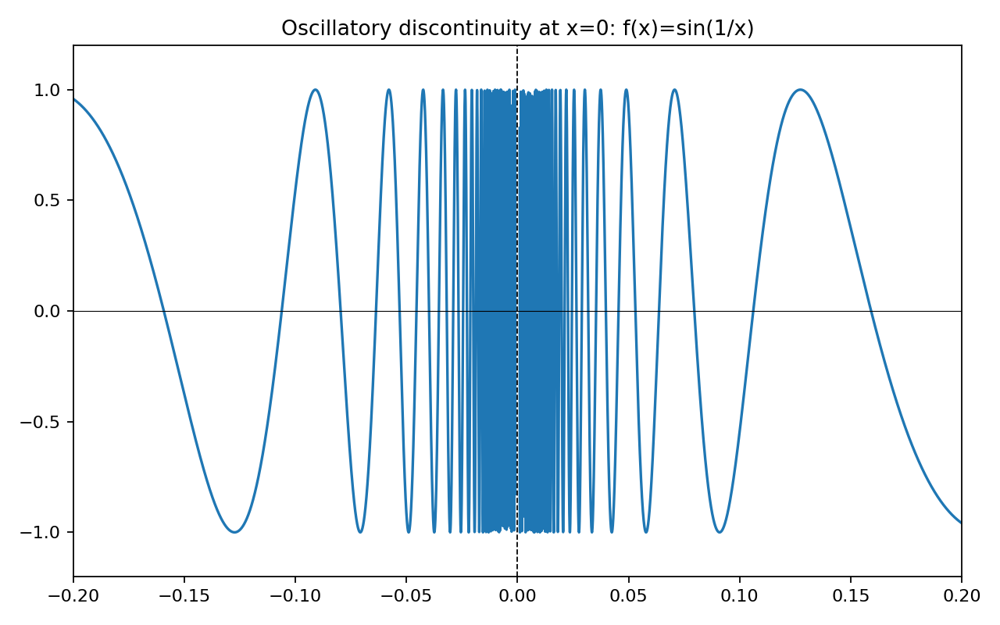
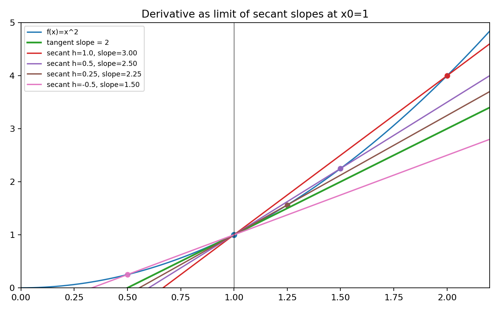
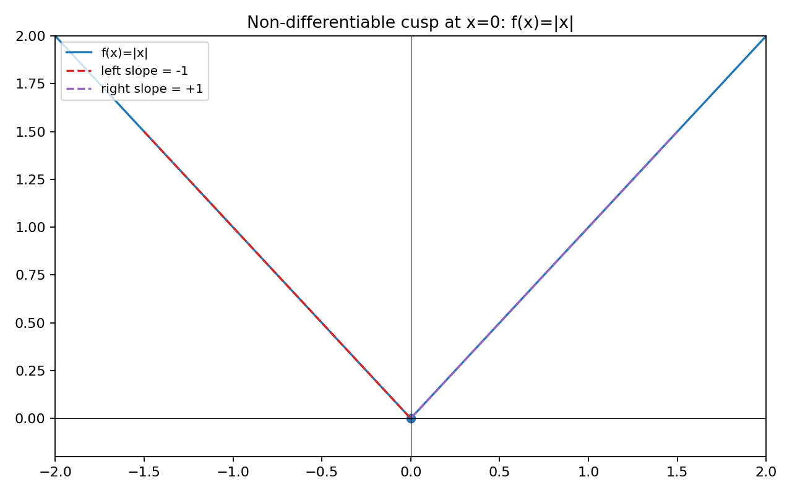

# 单变量微积分系列（三）：连续性与导数的定义

## 1. 连续性：微积分的“基线”与直觉

在前两篇文章中，我们从平均变化率出发，通过极限，逐步走近瞬时变化率（导数）。在把极限应用到函数本身之前，我们需要先回答一个基本问题：函数是否“行为良好”？也就是它是否**连续**。

直觉上，连续意味着：当输入 $x$ 发生很小的变化时，输出 $f(x)$ 也只发生很小的变化，且函数图像**没有断裂**，可以“一笔画完”。这既是微分学的必要前提，也是很多定理（如中值定理、微积分基本定理）的基础假设。

连续性的讨论分两个层次：
- 直观层面：图像是否光滑、是否出现断点、跳跃或竖直渐近线；
- 严格层面：用极限（尤其是 $\epsilon-\delta$ 语言）刻画在某点及其邻域中的行为。

本文先建立连续性的严格定义与判别方法，再用它引入并构造**导数**的定义与直观几何意义。

---

## 2. 连续性的严格定义（点处连续、区间连续）

设函数 $f$ 在点 $a$ 的某个邻域内有定义。我们称 $f$ 在点 $a$ **连续**，如果满足以下三个条件：
1. 函数在该点有定义：$f(a)$ 存在；
2. 极限存在：$\displaystyle \lim_{x\to a} f(x)$ 存在；
3. 极限值等于函数值：$\displaystyle \lim_{x\to a} f(x) = f(a)$。

这三个条件常被压缩为一句话：
$$\boxed{\quad f \text{ 在 } a \text{ 连续 } \iff \lim_{x\to a} f(x) = f(a) \quad}$$

进一步，如果 $f$ 在某个区间上的每一点都连续，则称 $f$ 在该区间上连续。

### $\epsilon-\delta$ 定义（严格刻画“足够接近”）

连续性的本质是：输入“足够接近”就能保证输出“足够接近”。严格语言如下：

对任意 $\epsilon > 0$，都存在 $\delta > 0$，使得当 $|x-a| < \delta$ 时，必有 $|f(x) - f(a)| < \epsilon$。这就是 $f$ 在 $a$ 处连续的 $\epsilon-\delta$ 定义。

它直接表达了连续的直觉：“只要把 $x$ 控制在离 $a$ 足够近（$\delta$-近）的小范围内，函数值 $f(x)$ 就能保证离 $f(a)$ 足够近（$\epsilon$-近）”。

### 单侧连续性

在端点或分段函数中，常需要讨论**左连续**与**右连续**：
- 左连续：$\displaystyle \lim_{x\to a^-} f(x) = f(a)$；
- 右连续：$\displaystyle \lim_{x\to a^+} f(x) = f(a)$。

一般点处连续要求左右两侧极限都存在且等于函数值。

---

## 3. 常见的不连续类型（图像与判别）

函数的不连续大致分为以下几类，下面给出图像与要点。

### 3.1 可去间断（Removable Discontinuity）

当 $\displaystyle \lim_{x\to a} f(x)$ 存在，但 $f(a)$ 未定义或定义为与极限不同的值时，称为**可去间断**。通过“补洞”（重新定义 $f(a)$ 为该极限），即可使其连续。

示例：$g(x) = \dfrac{\sin x}{x}$ 在 $x=0$ 的极限为 $1$。若定义 $g(0)=0$，则在 $0$ 处产生一个可去间断。

要点：若把 $g(0)$ 重新定义为 $1$，则 $g$ 在 $0$ 处变为连续。

### 3.2 跳跃间断（Jump Discontinuity）

左右极限均存在但不等，图像在该点存在“跳跃”，通常出现在分段或阶梯函数中。

示例：
$$f(x) = \begin{cases}
0, & x < 0 \\
1, & x \ge 0
\end{cases}$$

要点：$\lim_{x\to 0^-} f(x) = 0$，$\lim_{x\to 0^+} f(x) = 1$ 不相等，故极限不存在，点处不连续。

### 3.3 无穷间断（Infinite Discontinuity）

在点 $a$ 附近函数值趋向 $\pm\infty$，该点是**垂直渐近线**。常见如 $f(x)=1/x$ 在 $x=0$：

### 3.4 震荡间断（Oscillatory Discontinuity）

函数在某点附近发生频率不断增大的震荡，导致左右极限都不存在，且无法通过重定义该点使其连续。典型例子：$f(x)=\sin\!\left(\tfrac{1}{x}\right)$ 在 $x=0$ 处。

要点：当 $x\to 0$ 时，$\tfrac{1}{x}\to \pm\infty$，$\sin(\cdot)$ 在 $[-1,1]$ 区间内以无限次震荡覆盖所有值，极限不存在。

---

## 4. 连续函数的基本性质

了解连续函数的闭包性质很重要：
- 若 $f, g$ 在 $a$ 处连续，则 $f\pm g$、$fg$ 在 $a$ 处连续；若 $g(a)\ne 0$，则 $\dfrac{f}{g}$ 在 $a$ 处连续；
- 若 $f$ 在 $a$ 处连续且 $g$ 在 $f(a)$ 处连续，则复合函数 $g\circ f$ 在 $a$ 处连续；
- 多项式、指数、对数、三角函数在各自定义域内通常是连续的；
- **介值定理**：若 $f$ 在闭区间 $[a,b]$ 上连续，且 $f(a)$ 与 $f(b)$ 取值符号不同，则对任意介于 $f(a)$ 和 $f(b)$ 之间的数值 $L$，存在 $c\in(a,b)$ 使 $f(c)=L$。这是求根与二分法的理论基础。

---

## 5. 导数的几何直觉：割线趋近切线

导数刻画的是函数的**瞬时变化率**，几何上就是曲线在某点的**切线斜率**。从平均变化率（割线斜率）出发，令另一点无限靠近研究点，割线就趋近为切线。

下图以 $f(x)=x^2$ 在 $x_0=1$ 为例，展示不同 $h$ 值的割线斜率如何逼近切线斜率（$=2$）。

---

## 6. 导数的极限定义

设函数 $f$ 在 $a$ 的某邻域内可定义。若下式的极限存在，则称 $f$ 在 $a$ 可导，并把该极限称为 $f$ 在 $a$ 的导数：

$$\boxed{\quad f'(a) = \lim_{h\to 0} \frac{f(a+h) - f(a)}{h} \quad}$$

这一定义把“瞬间变化率”精确化为“当增量 $h$ 趋近于 $0$ 时的平均变化率的极限”。

常见等价写法（若极限存在）：
$$f'(a) = \lim_{x\to a} \frac{f(x) - f(a)}{x-a} \quad \text{或} \quad f'(a) = \lim_{h\to 0} \frac{f(a+h) - f(a-h)}{2h}$$

### 导数的记号与 d/dx（Leibniz 与 Newton）

单变量中常用的导数记号有三类，均表示同一含义：
- Newton 记号：$f'(x)$、$f''(x)$（一阶、二阶导数）。
- Leibniz 记号：设 $y=f(x)$，则 $\dfrac{dy}{dx}$、$\dfrac{d^2y}{dx^2}$ 分别表示一阶与二阶导数。它强调“相对于 $x$ 的变化”。
- 算子记号：$\dfrac{d}{dx}$ 视为“对 $x$ 求导”的线性算子，作用在函数上：$\big(\dfrac{d}{dx}\big)[f(x)] = f'(x)$。

基本性质（在定义域内并且涉及的导数存在时）：
- 线性性：$\dfrac{d}{dx}[a\,f(x)+b\,g(x)] = a\,f'(x)+b\,g'(x)$。
- 链式法则：$\dfrac{d}{dx}[g(f(x))] = g'(f(x))\,f'(x)$（后续一篇将系统证明与应用）。

记号对照举例：若 $y=\sin x$，则 $y' = \cos x$，$\dfrac{dy}{dx} = \cos x$，$\big(\dfrac{d}{dx}\big)[\sin x] = \cos x$。

### 例子：$f(x)=x^2$ 在任意点的导数

用定义计算：
$$\begin{align*}
f'(a) &= \lim_{h\to 0} \frac{(a+h)^2 - a^2}{h} \\
&= \lim_{h\to 0} \frac{a^2 + 2ah + h^2 - a^2}{h} \\
&= \lim_{h\to 0} (2a + h) = 2a.
\end{align*}$$

因此 $f'(x)=2x$。这与第 5 节图像的切线斜率完全一致。

---

## 7. 可导与连续：关系与反例

- 若 $f$ 在点 $a$ 可导，则 $f$ 在该点必连续（可导蕴含连续）。证明思路：由导数定义式可推出 $\lim_{x\to a} f(x)=f(a)$。
- 反之未必成立：连续不一定可导。典型反例是尖点或角点，比如 $f(x)=|x|$ 在 $0$ 处连续但不可导（左右导数不相等）。

### 可导蕴含连续（极限法证明）

设 $f'(a)$ 存在。令 $h=x-a$，有
$$f(a+h) - f(a) = h \cdot \frac{f(a+h) - f(a)}{h}.$$
当 $h \to 0$ 时，$\displaystyle \frac{f(a+h)-f(a)}{h} \to f'(a)$ 且 $h \to 0$，从而
$$\lim_{h\to 0} [f(a+h)-f(a)] = \big(\lim_{h\to 0} h\big) \cdot \big(\lim_{h\to 0} \tfrac{f(a+h)-f(a)}{h}\big) = 0 \cdot f'(a) = 0.$$
等价地，$\displaystyle \lim_{x\to a} f(x) = f(a)$，故 $f$ 在 $a$ 处连续。

### 连续不蕴含可导（反例与证明）

取 $f(x)=|x|$ 于 $x=0$。其连续性：$\displaystyle \lim_{x\to 0} |x| = 0 = f(0)$（或以 $\epsilon$–$\delta$：令 $\delta=\epsilon$ 即得）。
不可导性：计算左右差商
$$\lim_{h\to 0^-} \frac{|h|-0}{h} = \lim_{h\to 0^-} \frac{-h}{h} = -1, \qquad \lim_{h\to 0^+} \frac{|h|-0}{h} = \lim_{h\to 0^+} \frac{h}{h} = +1,$$
左右导数不相等，导数不存在，故在 $0$ 处不可导。

---

## 8. 常见函数的导数（基本表与法则）

在定义的基础上，我们通常通过一系列法则高效计算导数：

- 常数函数：$\dfrac{d}{dx}(C) = 0$；
- 幂函数：$\dfrac{d}{dx}(x^n) = n x^{n-1}$（$n$ 为实数时需在相应定义域）；
- 指数函数：$\dfrac{d}{dx}(e^x) = e^x$，更一般 $\dfrac{d}{dx}(a^x) = a^x\ln a$；
- 对数函数：$\dfrac{d}{dx}(\ln x) = \dfrac{1}{x}$（$x>0$）；
- 三角函数：$\dfrac{d}{dx}(\sin x)=\cos x$，$\dfrac{d}{dx}(\cos x)=-\sin x$，$\dfrac{d}{dx}(\tan x)=\sec^2 x$；
- 线性性：$\dfrac{d}{dx}[af(x)+bg(x)] = a f'(x) + b g'(x)$；
- 乘积法则：$\dfrac{d}{dx}[f(x)g(x)] = f'(x)g(x) + f(x)g'(x)$；
- 商法则：$\dfrac{d}{dx}\big[\dfrac{f}{g}\big] = \dfrac{f'g - fg'}{g^2}$（$g\ne 0$）；
- 链式法则：$\dfrac{d}{dx}[g(f(x))] = g'(f(x))\cdot f'(x)$。

这些法则的严格证明建立在极限与连续的性质上，后续一篇将系统推导与练习。

---

## 9. 练习

1) 判断下列函数在指定点是否连续，并说明理由：
   - $f(x)=\dfrac{x^2-1}{x-1}$ 在 $x=1$；
   - $f(x)=\begin{cases} x+1,&x<0\\ x^2,&x\ge 0\end{cases}$ 在 $x=0$；
   - $f(x)=\dfrac{1}{x}$ 在 $x=0$。

2) 用导数定义计算：
   - $f(x)=x^2$ 的 $f'(a)$；
   - $g(x)=\sqrt{x}$ 的 $g'(a)$（$a>0$）。

3) 讨论 $f(x)=|x|$ 在 $x=0$ 的可导性。

---

## 10. 总结与展望

- 连续性用极限精确刻画，是微分学的基线；不连续的类型（可去、跳跃、无穷）有清晰的图像与判别；
- 导数定义把“瞬时变化率”严格化为差商的极限，几何上就是切线斜率；
- 可导蕴含连续，但连续不必可导（尖点、角点、竖切线等）。

下一篇我们将系统整理与证明**微分法则**（线性、乘积、商、链式）与**常见函数的导数**推导，并通过练习加深理解。

---